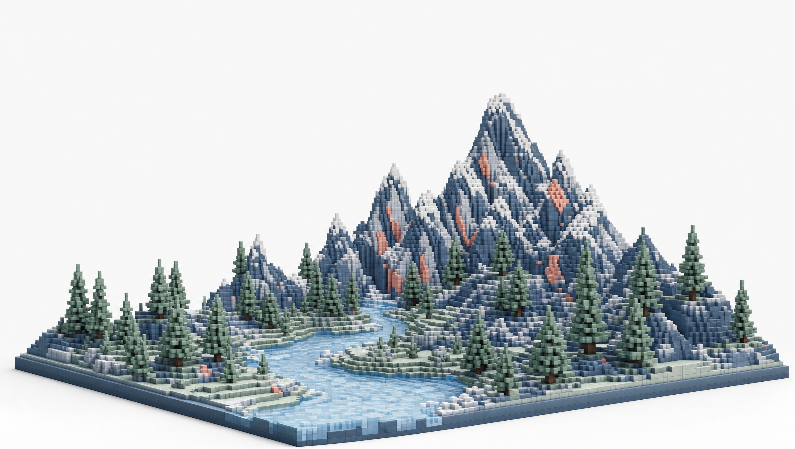

# Taste Vault

**Inspiration in, vocabulary out.** A local, zero-build design-taste gallery that turns screenshots of sites you love into objective design vocabulary, clustered collections, and paste-ready brief blocks for Claude Code.

Built as the companion tool for the video **[Turn Claude Into A Design GENIUS In 3 Simple Steps](https://youtu.be/7FU98O0JLHs)**. This repo ships with my real vault — 28 entries across 7 collections plus my House DNA — so you can see the whole system working before you replace my taste with yours.



---

## Why this exists

AI has no taste. Left alone, Claude regresses to the mean: purple gradients, glossy SaaS blobs, Inter-only typography, icon-grid feature rows. Not because it can't do better — because "make it look good" gives it nothing to aim at.

The fix isn't a magic prompt. It's a **3-step process**, and the Taste Vault is Step 1:

### Step 1 — Curate taste *(this repo)*

You can't inject taste you haven't collected. Expose yourself to high-level web design (Dribbble, Pinterest, Twitter/X, awards sites), screenshot what stops you, and feed it into the vault. The ingest pipeline breaks every screenshot into:

- **Objective vocabulary** — 5–8 promptable terms an expert would use ("halftone texture", "registration marks", "giant cropped wordmark"), never opinions
- **A collection** — a distinct, deployable look ("Print-Tech Paper", "Dither Mono") it gets clustered into
- **An image recipe** — an image-gen prompt that recreates the screenshot's hero *style* with the subject swapped out
- **A stealable-idea note** — the single move worth taking from it

Over time the vault becomes your personal design language: collections you deploy per-project, over shared **House DNA** (constants + a never-list) that makes every page recognizably yours.

### Step 2 — Equip Claude with skills & tools

Out of the box, Claude Code doesn't critique its own spatial design or generate hero imagery. Give it:

- **[Impeccable](https://github.com/pbakaus/impeccable)** — 23 design commands like `/bolder` / `/quieter` that critique and polish spacing, typography, and color
- A **taste / anti-slop skill** — hunts for AI-slop tells and pushes stronger layouts
- **Higgsfield MCP** (or any image-gen tool) — because Claude can't paint the background, and the hero image usually *is* the aesthetic
- **[21st.dev](https://21st.dev)** — component prompts for buttons/cards so the UI details aren't boilerplate

### Step 3 — The build sequence

Never one-shot a design. Iterate in a funnel:

1. **Cast wide** — ask Claude for **5 versions in 5 different aesthetic families** (pull family names from your vault's collections)
2. **Narrow** — pick the direction you like, get **3 variations** of that aesthetic
3. **Tinker** — pick the winner, generate the hero asset from the entry's image recipe, iterate details (a "tweaks bar" on the dev server makes font/size/accent iteration instant)

Every build prompt has four parts: **Aesthetic + Reference image + Intent + Guardrails.** The Taste Vault hands you three of the four — that's what the **COPY BRIEF BLOCK** button assembles.

---

## Quick start

```bash
git clone https://github.com/cth9191/taste-vault.git
cd taste-vault
python -m http.server 4610      # or serve.bat on Windows, or any static server
# open http://localhost:4610
```

Any static server works — `fetch()` needs `http://`, not `file://`. No build step, no dependencies: the app is one vanilla `index.html`.

**For ingesting your own screenshots** you additionally need:

- [Node.js](https://nodejs.org) (the ingest script)
- [Claude Code](https://claude.com/claude-code) CLI on your PATH (the vision extraction runs through `claude -p`)

---

## Using the vault in a project

1. Open the gallery and pick the collection matching the project's soul (each collection lists what it **deploys for**)
2. Click **COPY BRIEF BLOCK** — it assembles: collection vocabulary + reference entries + House DNA constants + never-list + a one-risk suggestion + hero-asset instruction
3. Paste it at the top of your Claude Code prompt, add your **intent** (what the site is for), and run the Step-3 funnel

The entry modal has two more buttons:

- **COPY BRIEF** — a single-entry brief with the local screenshot path included so Claude Code can read the reference image directly
- **COPY IMAGE PROMPT** — the entry's image recipe; replace `[SUBJECT: ...]` with your product's subject, generate at 2K (I use Higgsfield `gpt_image_2`), and hand the asset to Claude Code alongside the brief

## Ingesting your own inspiration

```bash
node ingest.js "C:\path\to\screenshot.png" [more paths...]
```

Each image is copied into `images/`, run through `claude -p` vision extraction, and merged into `data/gallery.json` — assigned to an existing collection, or seeding a **new** collection when it genuinely fits none. Refresh the page after.

## Making it yours

The repo ships with my taste as a working demo. To start your own vault:

1. Open `data/gallery.json`
2. Set `meta.owner` to your name and `meta.imagesPath` to the **absolute path** of this repo's `images/` folder on your machine (used so pasted briefs resolve the reference screenshot from any project directory)
3. Either keep my collections as starting points, or reset: set `"entries": []` and `"collections": []`, then rewrite `dna.constants` and `dna.never` for your own eye — the never-list matters as much as the constants
4. Delete my screenshots from `images/` if you want a clean slate, then ingest your own

Editing `data/gallery.json` by hand is always fine — it's the source of truth. Re-cluster by changing an entry's `collection`.

`data/styles.json` powers the **◈ REFERENCE STYLES** tab: the standard aesthetic families of the modern web (editorial minimalism, warm editorial, brutalism, …), each with recognition cues, vocabulary, canonical example sites, and its own COPY BRIEF button — borrowed language for looks your own inspo doesn't cover yet.

## Structure

```
index.html          # the whole app (vanilla JS, no build)
data/gallery.json   # entries + collections + House DNA — the taste database
data/styles.json    # reference aesthetic families of the modern web
images/             # slugged screenshot copies (the demo seed set)
generated/          # example hero assets produced from image recipes
ingest.js           # claude -p vision extraction pipeline
serve.bat           # Windows one-click server
```

## Data model

- **entry** — one screenshot → `id, file, title, collection, family, vocabulary[], note, imageRecipe, heroUsage, added`
- **collection** — a deployable look → `vocabulary` block, `deployFor`, `risk` suggestion, `accent`, collection-level `imageStyle` template
- **dna** — `constants[]` + `never[]`, appended to every brief

## License

MIT — see [LICENSE](LICENSE). The screenshots in `images/` are of third-party websites, included as personal design references; all rights to those designs remain with their creators. Swap them for your own inspiration.
